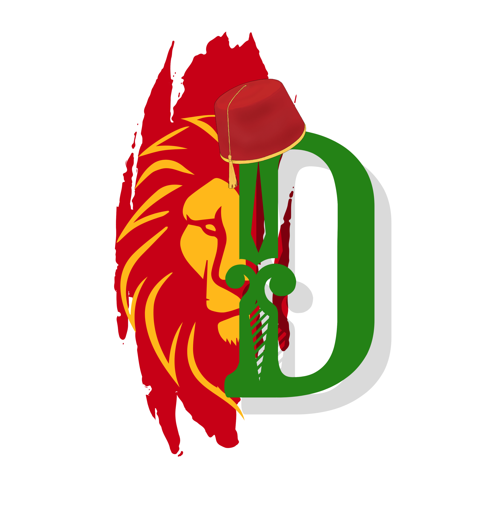

# DarijaScript

DarijaScript is a programming language inspired by the Moroccan Arabic language.

<br clear="right"/>

## Note

DarijaScript is not intended for serious projects or production use.
It's a lighthearted experiment in language design and cultural expression.
Have fun exploring and playing around with DarijaScript!

## Getting Started

You can get started with DarijaScript by using the [DarijaScript Starter](https://github.com/rabraghib/darijascript-starter) template.

### Installation

To install DarijaScript, you need to have [Go](https://go.dev/) installed.
After installing Go, you can use the following command to install DarijaScript:

```bash
go install github.com/rabraghib/darijascript@latest
```

Make sure your Go bin directory is in your system's PATH.

### Usage

You can either write your DarijaScript code in a file and run it:

```bash
darijascript run my_program.ds
```

Or you can run DarijaScript in interactive mode:

```bash
darijascript interactive
```

### Examples

Discover various DarijaScript code examples in the [examples](examples) folder.

## Documentation

Refer to the [DarijaScript Online Playground](https://darijascript.rabraghib.me) for an interactive experience and detailed documentation.

## 🤗 Before you go!

Contributions are always welcome!

If you want to show some support, you can:

- Give [DarijaScript repo](https://github.com/rabraghib/darijascript) a star ⭐ on Github.
- Follow [@rabraghib](https://twitter.com/rabraghib) on Twitter to stay up to date with all the cool stuff happening.
- 💰 Help DarijaScript grow and be more awesome: [Buy me a coffee](https://www.buymeacoffee.com/rabraghib).

---

<p align="center">Made with ❤️ by <a href="https://www.rabraghib.me">Rabyâ Raghib</a></p>
